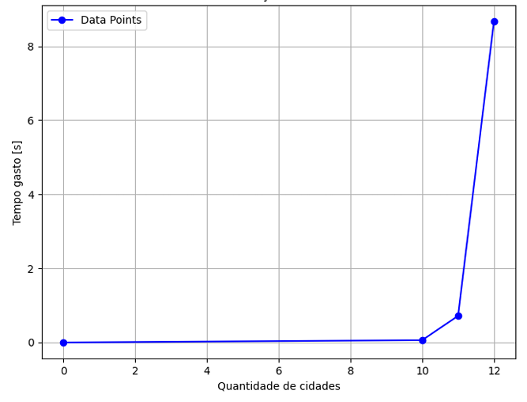
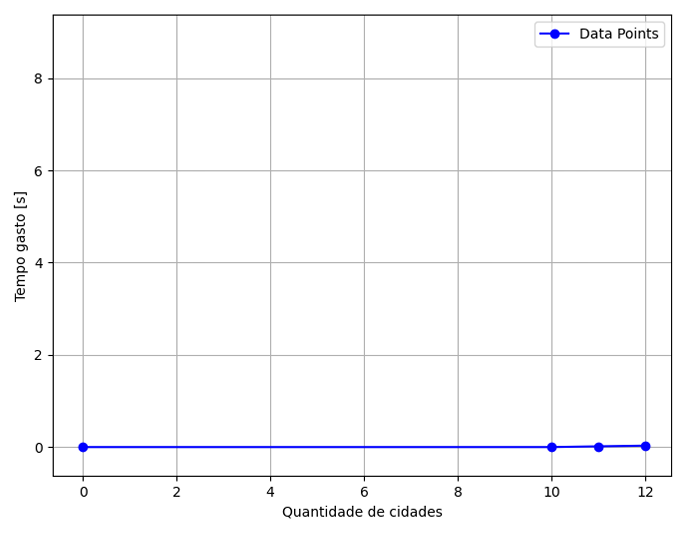

# Problema do Caixeiro Viajante (TSP)

---

## Autores
- [Gabriel Phelippe](https://github.com/Gabrielphpr "Acesse Gabrielphpr")
- Mariana Cardoso
- [Gabriel Campanelli](https://github.com/GabrielIamato "Acesse GabrielIamato")

---

## Sumário

- [Algoritmo e Estrutura de Dados I: O Problema do Caixeiro Viajante](#algoritmo-e-estrutura-de-dados-i-o-problema-do-caixeiro-viajante)
  - [Algoritmo de Força Bruta: Fundamentos e Implementação](#algoritmo-de-força-bruta-fundamentos-e-implementação)
  - [Algoritmo Held-Karp: Otimizando o PCV](#algoritmo-held-karp-otimizando-o-pcv)
  - [Implementação e Estrutura do Projeto](#implementação-e-estrutura-do-projeto)
  - [Conclusão](#conclusão)

## O tal problema do Caixeiro Viajante...

Este projeto aborda a solução do Problema do Caixeiro Viajante utilizando dois algoritmos distintos: o método de Força Bruta e o algoritmo Held-Karp. O objetivo é comparar as abordagens, analisar suas complexidades e validar os resultados empiricamente. 

### Algoritmo de Força Bruta: Fundamentos e Implementação

O algoritmo de Força Bruta resolve o PCV explorando todas as possíveis permutações de caminhos entre as cidades. A condição para a solução é que o caminho escolhido tenha a menor distância total, passando por todas as cidades requisitadas e retornando à cidade inicial. A implementação utiliza uma estrutura de lista encadeada para armazenar as conexões entre as cidades, priorizando a otimização de memória. A busca pelo menor caminho é realizada por meio de permutações recursivas, calculando a distância de cada combinação possível.

A complexidade do algoritmo foi analisada como O(n! * m), onde n é o número de cidades e m é o número de caminhos. Isso se deve ao fato de que o algoritmo verifica todas as (n-1)! permutações possíveis e, para cada uma, realiza uma busca sequencial nas listas de conexões. Os testes empíricos confirmam essa análise, mostrando um comportamento exponencial conforme o número de cidades aumenta. Um gráfico ilustrando esse comportamento pode ser inserido abaixo:

*Figura 1: Comportamento do algoritmo de força bruta*

### Algoritmo Held-Karp: Otimizando o PCV

O algoritmo Held-Karp utiliza programação dinâmica para resolver o PCV de forma mais eficiente. Ele armazena soluções parciais em uma tabela de subproblemas, representados por máscaras de bits, onde cada posição indica a menor distância para visitar um subconjunto de cidades terminando em uma cidade específica. A tabela é preenchida iterativamente, evitando a redundância de cálculos presentes na abordagem de Força Bruta.

A complexidade do Held-Karp é O(m * n² * 2ⁿ), significativamente menor que a da Força Bruta para instâncias moderadas do problema (até 20 cidades). Os testes empíricos demonstram que o tempo de execução permanece baixo mesmo para entradas maiores, em contraste com o crescimento abrupto do método de Força Bruta. Um gráfico demonstrando os tempos de execução baixos pode ser inserido abaixo:

*Figura 2: Comportamento do algoritmo Held-Karp*

.png)

*Figura 2: Comportamento do algoritmo Held-Karp (ampliado)*

### Implementação e Estrutura do Projeto

O projeto foi implementado em C e organizado em módulos:

main.c: Responsável pela leitura do arquivo de entrada e inicialização dos algoritmos.

lista.c e lista.h: Implementam a estrutura de lista encadeada para armazenar conexões entre cidades.

pcv.c e pcv.h: Contêm as funções de permutação (Força Bruta) e programação dinâmica (Held-Karp).

cidade.h: Define a estrutura de distâncias entre as cidades.

O Makefile fornecido permite compilar (make all), executar (make run) e limpar os arquivos gerados (make clean). Para executar o programa, é necessário ajustar o nome do arquivo de entrada no Makefile.

### Conclusão
Este projeto demonstra a eficácia do algoritmo Held-Karp em comparação à abordagem de Força Bruta para resolver o PCV. Enquanto o método de Força Bruta se torna inviável para instâncias maiores devido à sua complexidade fatorial, o Held-Karp oferece uma solução viável para problemas de tamanho moderado, graças à sua estratégia de programação dinâmica. Os resultados empíricos corroboram as análises teóricas, evidenciando a superioridade do Held-Karp em termos de desempenho.

## Licença
Este projeto está licenciado sob a licença MIT - veja o arquivo [LICENSE](LICENSE) para detalhes.
